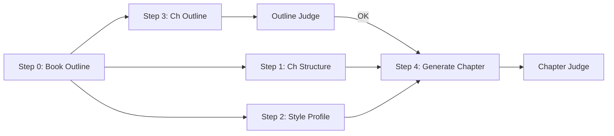

# IMPLEMENTATION_NOTES.md – Agentic Enterprise Chapter Pipeline

This document is for engineers integrating the **Agentic Enterprise Chapter Pipeline** into QUCreate, Smolagents, LangGraph, or similar LLM orchestration systems.

It complements the high-level `README.md` by adding:

- Concrete orchestration patterns  
- Suggestions for multi-model + multi-step configuration  
- How to plug in LLM-as-judge evaluators  
- Notes for QUCreate-style “spec → artifact” workflows  

---

## 1. Mental Model for Engineers

Treat the pipeline as a **build system for chapters**:

- Each step is a **pure function** from structured text inputs → structured text output.
- All IO is in Markdown files with **strict schemas** (e.g., `book_outline.md`, `chapter_outline_{CHAPTER_ID}.md`).
- Prompts are versioned in `prompts/prompts_reference.md`.
- Models are configured per-step (e.g., fast model for extraction steps; strong model for generation).

This lets you:

- Re-run any step deterministically when inputs or prompts change.
- Swap models or backends without rewriting business logic.
- Layer human-in-the-loop review in between steps.

---

## 2. Suggested Code Architecture

At a high level:

```text
/agentic-enterprise/
  /global/
    book_outline.md
    style_profile.md
    example_style.md
  /chapters/
    /ch01/
      rough_chapter_1.md
      structure_chapter_1.md
      chapter_outline_1.md
      Chapter_1.md
  /prompts/
    prompts_reference.md
  /src/
    orchestrator.py
    llm_client.py
    schemas.py
    runners/
      step0_book_outline.py
      step1_structure.py
      step2_style.py
      step3_outline.py
      step4_chapter.py
      judges.py
  /logs/
    *.jsonl
```

Key ideas:

- `llm_client.py`  
  - Thin wrapper over your chosen SDK (OpenAI, Anthropic, Gemini, DeepSeek, etc.).  
  - Exposes `call_llm(system_prompt, user_prompt, model_name, temperature, ...)`.

- `schemas.py`  
  - Contains the canonical Markdown schema snippets (as strings) for:
    - `book_outline.md`
    - `style_profile.md`
    - `structure_chapter_{CHAPTER_ID}.md`
    - `chapter_outline_{CHAPTER_ID}.md`
  - These are embedded into user prompts at runtime.

- `runners/stepX_*.py`  
  - Each file wraps a single pipeline step (0–4, judges).
  - Handles:
    - Input gathering (file reads + slicing `book_outline.md`)
    - Prompt construction (pull from `prompts_reference.md`)
    - Model call
    - Output file writes

---

## 3. Orchestration Patterns

### 3.1 QUCreate

QUCreate is naturally aligned with this pipeline:

- Each step is a **“spec → artifact”** transformation:
  - Spec: input Markdown files and prompts.
  - Artifact: output Markdown file under `/global` or `/chapters/chXX`.

Suggested pattern:

1. Represent each step as a **QUCreate task**:
   - `task_step0_book_outline(raw_book_outline_path) -> book_outline_path`
   - `task_step2_style(example_style_path, book_outline_path) -> style_profile_path`
   - `task_step3_outline(chapter_id, rough_chapter_path, book_outline_path) -> chapter_outline_path`
   - etc.

2. Each task stores:
   - Input file paths + hashes
   - System + user prompt versions
   - Model + parameters
   - Output file path

3. QUCreate UI:
   - Allow users to open and edit:
     - `book_outline.md`
     - `style_profile.md`
     - `chapter_outline_{CHAPTER_ID}.md` (especially placeholders)
   - Then re-run downstream tasks.

This turns the pipeline into an interactive, reproducible **editorial build system**.

### 3.2 Smolagents

In Smolagents, treat each step as a **tool**:

- A tool is a function like:

  ```python
  def step3_outline_tool(chapter_id: str, rough_chapter_path: str) -> str:
      # returns path to chapter_outline file
  ```

- The agent’s job:
  - Choose when to run:
    - Step 1 vs Step 3 vs Step 4.
  - Check existence of files:
    - If `chapter_outline_{CHAPTER_ID}.md` is missing, run Step 3.
    - If it exists but is outdated, call Step 3 again with updated rough draft.

Minimal agent design:

- System prompt: “You are a production editor orchestrator for Agentic Enterprise. Your tools run pipeline steps and return file paths. Your goal is to produce an up-to-date `Chapter_{CHAPTER_ID}.md`.”
- Tools:
  - `read_file(path) -> content`
  - `write_file(path, content)`
  - `step*_tool(...)` (wrapping each step runner)

### 3.3 LangGraph (or other graph orchestrators)

In LangGraph, each step becomes a **node**:

- Nodes:
  - `step0_book_outline`
  - `step2_style`
  - `step1_structure_chapter`
  - `step3_outline_chapter`
  - `step4_generate_chapter`
  - `outline_judge`
  - `chapter_judge`

- Edges:
  - `step0 -> step2`
  - `step0 -> step1`
  - `step0 -> step3`
  - `step2 -> step4`
  - `step1 -> step4`
  - `step3 -> outline_judge -> step4` (with optional HIL)
  - `step4 -> chapter_judge`

Mermaid-style:



LangGraph’s strengths:

- You can mark edges as **conditional**:
  - e.g., Only run `step4` if `Outline Judge` score >= 7.
- You can persist graph state as JSON for replay.

---

## 4. Model & Prompt Management

### 4.1 Models per Step

Suggested defaults:

- Step 0 (book outline extraction):  
  - `gpt-5.1-mini` or equivalent (high-quality but cost-efficient).
- Step 1 (structure) & Step 2 (style):  
  - `gpt-5.1-thinking` or equivalent (more reasoning).
- Step 3 (outline extraction):  
  - `gpt-5.1-mini`.
- Step 4 (chapter generation):  
  - `gpt-5.1-thinking` (best writing quality).
- Judges:  
  - `gpt-5.1-thinking` or equivalent.

Expose this via a `config.yaml` your orchestrator can load:

```yaml
models:
  step0: gpt-5.1-mini
  step1: gpt-5.1-thinking
  step2: gpt-5.1-thinking
  step3: gpt-5.1-mini
  step4: gpt-5.1-thinking
  outline_judge: gpt-5.1-thinking
  chapter_judge: gpt-5.1-thinking
```

### 4.2 Prompt Sources

- Keep all prompts in `prompts/prompts_reference.md`.
- At runtime, your code should:
  - Load the file once.
  - Split into blocks by headers (e.g., `## Step 0 – Book Outline Abstractor`).
  - Extract:
    - System prompt text
    - User prompt template

Log the **prompt version** (e.g., git commit) with each run.

---

## 5. Human-in-the-Loop (HIL) Integration

There are two key points for human review:

1. After **Step 3** (`chapter_outline_{CHAPTER_ID}.md`):
   - Editors can:
     - Refine the central question.
     - Edit `Key Tensions`, `Core Ideas`.
     - Fill or rewrite `[[PLACEHOLDER: ...]]` entries.
   - Once done, re-run Step 4.

2. After **Step 4** (`Chapter_{CHAPTER_ID}.md`):
   - Editors can:
     - Mark sections as “locked” (no longer to be rewritten by LLM).
     - Add new placeholders for examples, stories, or data points.

QUCreate is well-suited to manage this:

- Each artifact is a QUCreate document with:
  - LLM provenance (which step produced it).
  - Manual edits history (authors, timestamps).
- Your pipeline should **not overwrite** manually edited sections unless explicitly triggered.

---

## 6. Implementation Notes for Judges

Judges run as **read-only quality checks**.

Implementation pattern:

```python
outline_ok = run_outline_judge(chapter_id)
if outline_ok.score_alignment < 7 or outline_ok.score_structure < 7:
    # Flag in UI, halt auto-generation
    return
chapter_ok = run_chapter_judge(chapter_id)
if chapter_ok.score_style < 7:
    # Suggest manual edits or a revised generation
    ...
```

Store judge outputs as JSON in `/logs/`:

```json
{
  "chapter_id": "1",
  "run_id": "2025-11-24T15:31:00Z",
  "structure_completeness": 8,
  "alignment": 9,
  "placeholder_clarity": 7,
  "coverage": 8,
  "notes": [
    "Clarify central question wording.",
    "Add at least one concrete example of off-brand content."
  ]
}
```

---

## 7. Error Handling & Idempotency

### 7.1 Common Failure Modes

- LLM adds commentary outside the Markdown schema.
- Model partially truncates output.
- Placeholders get altered or removed in Step 4.
- Multi-chapter runs hit rate limits.

### 7.2 Recommended Guards

- After each step:
  - Validate:
    - File is non-empty.
    - Contains expected headings (regex checks).
  - For Step 4:
    - Ensure **all placeholders** from `chapter_outline_{CHAPTER_ID}.md` exist in `Chapter_{CHAPTER_ID}.md`.
    - If not, fail the run and re-run or flag for review.

- Implement **exponential backoff** and retries for API errors.

- Prefer **small-batch** runs:
  - e.g., generate or update 1–3 chapters at a time, not all 10.

---

## 8. Performance & Cost Considerations

- Steps 0–3 are **one-off or infrequent**:
  - You can accept higher latency; they’re not in the hot path.
- Step 4 can be costlier:
  - To reduce cost:
    - Allow “partial regeneration” of sections later (e.g., just re-run Part II).
    - Cache and reuse structure/style/context where possible.
- Judges:
  - You can skip judge runs for small edits.
  - Or run them only for “pre-publication” passes.

---

## 9. Summary Checklist

For engineers:

- [ ] Implement `llm_client.call_llm(system, user, model)` with logging.
- [ ] Implement runners for Steps 0–4 using `prompts_reference.md`.
- [ ] Implement Outline Judge and Chapter Judge using provided prompts.
- [ ] Wire a simple CLI or QUCreate/Smolagents/graph interface to:
  - [ ] Run per-chapter pipeline end-to-end.
  - [ ] Inspect and edit intermediate artifacts.
- [ ] Validate:
  - [ ] Placeholders preserved.
  - [ ] Headings match structure schemas.
  - [ ] Logs capture inputs, prompts, models, and outputs.

If these boxes are ticked, the Agentic Enterprise pipeline will behave like a solid, testable build system for your book.